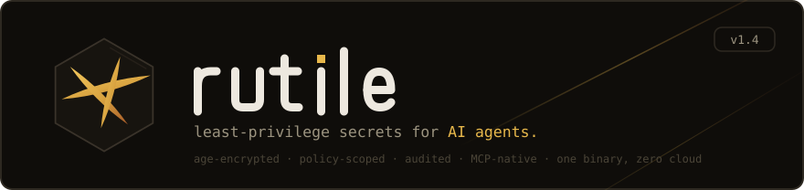
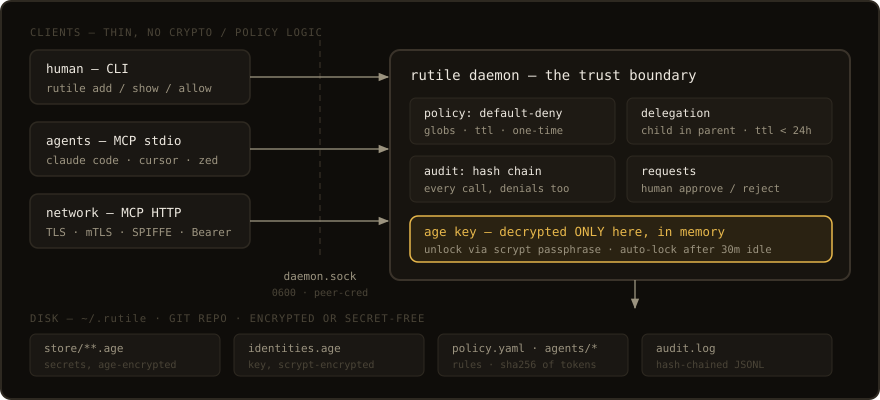

<p align="center">
  
</p>

<p align="center">
  
  
  
  
  
</p>

<p align="center">
  <a href="README.md">English</a> · <b>Русский</b> · <a href="https://lercas.github.io/rutile-site/">Сайт</a> · <a href="AGENTS.md">AGENTS.md</a> · <a href="SECURITY.md">SECURITY.md</a> · <a href="CHANGELOG.md">CHANGELOG</a>
</p>

Rutile представляет собой локальный брокер секретов для людей и AI-агентов.
Он хранит значения в зашифрованном виде, выдаёт каждому агенту отдельную
идентичность и по умолчанию запрещает доступ. Временные разрешения, запросы
доступа, делегирование и журнал аудита делают действия агентов явными и
проверяемыми.

## Быстрый старт

```bash
go install github.com/Lercas/rutile/cmd/rutile@latest

rutile init
rutile add dev/myproject/api-key
rutile show dev/myproject/api-key
```

Демон запускается при первом обращении. Если хранилище заблокировано, команда
запросит парольную фразу. После 30 минут бездействия расшифрованный ключ
удаляется из памяти.

Существующие данные можно импортировать из passage, pass или файла окружения:

```bash
rutile import passage
rutile import pass
rutile import env .env --prefix dev/myproject
```

## Подключение агента

```bash
rutile agent add claude --type claude-code
rutile allow claude "dev/**" --for 1h
```

Первая команда показывает токен один раз. Передайте его агенту через переменную
`RUTILE_TOKEN`. Не сохраняйте токен в исходном коде или логах. Всё, что не
разрешено явно, остаётся запрещённым.

| Инструмент MCP | Назначение |
|---|---|
| `get_secret` | Читает разрешённое значение и при необходимости записывает причину |
| `list_secrets` | Показывает только доступные агенту пути |
| `request_access` | Создаёт запрос доступа для проверки человеком |
| `delegate_access` | Выпускает ограниченный временный токен для помощника |
| `store_status` | Показывает состояние хранилища и число видимых путей |

Полный контракт MCP и обработка ошибок описаны в [AGENTS.md](AGENTS.md).
В репозитории также есть плагин Claude Code в `.claude-plugin/`.

## Доступ и делегирование

Правила поддерживают шаблоны путей, срок действия через `--for` и одноразовое
чтение через `--one-time`. Запрещённый запрос появляется в `rutile requests`.
Для решения используйте `rutile approve <id>` или `rutile reject <id>`.

Каждое решение записывается в связанный хешами журнал. Команда
`rutile audit verify` обнаруживает изменённые и удалённые записи. Такая цепочка
показывает вмешательство, но владелец файла может переписать журнал и
пересчитать хеши.
Если этот риск важен, экспортируйте контрольные точки во внешнее хранилище с
дозаписью без изменения старых данных.

Делегированный токен получает пересечение собственных шаблонов и действующих
правил родителя. Максимальный срок составляет 24 часа, глубина делегирования
равна одному уровню. Отзыв или ограничение родителя сразу действует на его
дочерние токены.

```bash
rutile delegations
rutile delegations revoke <id>
```

## Запуск команд с секретами

Если команде нужен секрет, но вызывающей стороне не требуется само значение,
используйте передачу через переменную окружения:

```bash
rutile run -e API_KEY=dev/svc/key -- sh -c 'curl -H "X-Key: $API_KEY" https://api.example.com'
rutile run --allow-argv-secrets -- deploy --token {{rutile:deploy/token}}
```

В первом варианте значение не попадает в текст команды и историю оболочки. Это
не защита от утечки внутри дочернего процесса: он всё ещё может вывести или
записать своё окружение. Подстановка в аргументы по умолчанию отключена, потому
что аргументы могут попасть в список процессов и телеметрию.

Размер значения ограничен **512 КиБ**. Rutile предназначен для учётных данных
и небольших параметров конфигурации, а не для наборов данных и произвольных
двоичных объектов.

## Устройство

<p align="center">
  
</p>

Один бинарный файл предоставляет CLI, демон и MCP-сервер. MCP работает через
stdio и потоковый HTTP. Локальные компоненты обмениваются JSON-сообщениями по
Unix-сокету. Значения и закрытая идентичность зашифрованы с помощью age. Токены
хранятся только в виде хешей SHA-256. Хранилище является Git-репозиторием и
может синхронизироваться командой `rutile git push`.

Поддерживаются Claude Code, Claude Desktop, Cursor, Windsurf, Zed, Cline, Roo
Code, Continue, OpenAI Agents SDK, LangChain, LangGraph, CrewAI, AutoGen и
собственные MCP-клиенты.

## Выделенный сервер

```bash
rutile mcp --http 0.0.0.0:7997 --tls-cert cert.pem --tls-key key.pem
```

Для HTTP не на loopback-интерфейсе обязателен TLS. Используйте `--insecure`
только внутри защищённого туннеля SSH или WireGuard. Ограничение частоты
запросов по IP включено по умолчанию.

Параметр `--tls-client-ca` включает mTLS. Вместе с
`--spiffe-trust-domain <domain>` он разрешает вход без токена для подходящего
URI SAN: `spiffe://<domain>/agent/<name>`. Без домена доверия клиентский
сертификат проверяется, но токен Bearer всё равно требуется.

На общем сервере запускайте демон под отдельной учётной записью:

```bash
rutile daemon --socket-mode 0660 --admin-uid <uid>
```

В системном режиме операции человека проверяются по данным ядра о владельце
процесса. Шлюз mTLS должен работать от имени владельца демона. Шаблоны служб
находятся в [`contrib/`](contrib). Установите `rutile-daemon@.service` как
`rutile-daemon@<admin-uid>.service`, а `rutile-mcp.service` запускайте под той
же выделенной учётной записью.

При ротации ключа резервные копии сохраняются как `identities.age.bak` и
`identities.age.bak-*`. Проверьте новый ключ перед удалением любой копии.

## Границы безопасности

В обычном режиме политика ограничивает добросовестных агентов и фиксирует их
действия. Любой процесс, запущенный от вашего пользователя, может обратиться к
демону с вашими правами и обойти политику агента. Системный режим переносит эту
границу на отдельную учётную запись операционной системы.

Срок действия ограничивает будущий доступ, но не отзывает уже полученное
значение. Пути секретов, имена агентов и правила остаются на диске открытым
текстом. Go не гарантирует немедленное удаление байтов секрета из памяти.
Полная модель угроз описана в [SECURITY.md](SECURITY.md).

## Разработка

```bash
make test          # модульные и интеграционные тесты с детектором гонок
make test-linux    # тот же набор тестов в Docker
make smoke         # сквозная проверка, включая mTLS и ограничение запросов
make release-check # все проверки перед выпуском
```

Исходный код сайта и инструкции по сборке находятся в репозитории
[`Lercas/rutile-site`](https://github.com/Lercas/rutile-site).

Тег `v*` запускает процесс выпуска. Он собирает архивы для платформ и исходного
кода, CycloneDX SBOM, контрольные суммы и подтверждения происхождения GitHub.
Наличие этой настройки само по себе не доказывает, что публичный или
подписанный выпуск существует. Проверяйте страницу выпуска и подтверждения
отдельно.

## Лицензия

MIT

<p align="center">
  <br>
  <sub><code>© rutile contributors · MIT</code></sub>
</p>
